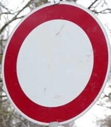
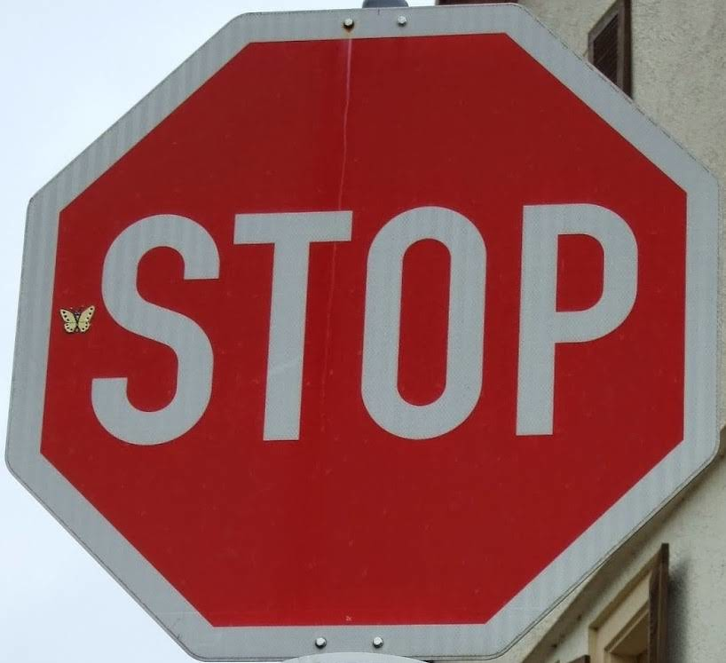

# **Traffic Sign Recognition**

## Writeup

### You can use this file as a template for your writeup if you want to submit it as a markdown file, but feel free to use some other method and submit a pdf if you prefer.

---

**Build a Traffic Sign Recognition Project**

The goals / steps of this project are the following:
* Load the data set (see below for links to the project data set)
* Explore, summarize and visualize the data set
* Design, train and test a model architecture
* Use the model to make predictions on new images
* Analyze the softmax probabilities of the new images
* Summarize the results with a written report

[//]: # (Image References)

[image1_1]: ./writeup_images/histogram_of_training.png "Histogram of training data set"
[image1_2]: ./writeup_images/histogram_of_validation.png "Histogram of validation data set"
[image1_3]: ./writeup_images/histogram_of_test.png "Histogram of test data set"
[image2_1]: ./writeup_images/augmented_image.png "Augmented Image"
[image3_1]: ./german_traffic_sign/german_traffic_sign_001.png "No vehicles1"
[image3_2]: ./german_traffic_sign/german_traffic_sign_002.png "Slippery road"
[image3_3]: ./german_traffic_sign/german_traffic_sign_003.png "No vehicles2"
[image3_4]: ./german_traffic_sign/german_traffic_sign_004.png "Speed limit (30km/h)1"
[image3_5]: ./german_traffic_sign/german_traffic_sign_006.png "Speed limit (70km/h)1"
[image3_6]: ./german_traffic_sign/german_traffic_sign_007.png "No entry"
[image3_7]: ./german_traffic_sign/german_traffic_sign_008.png "Speed limit (30km/h)2"
[image3_8]: ./german_traffic_sign/german_traffic_sign_009.png "Priority road"
[image3_9]: ./german_traffic_sign/german_traffic_sign_010.png "Traffic signals"
[image3_10]: ./german_traffic_sign/german_traffic_sign_011.png "Stop"
[image3_11]: ./german_traffic_sign/german_traffic_sign_012.png "Turn right ahead"

## Rubric Points
### Here I will consider the [rubric points](https://review.udacity.com/#!/rubrics/481/view) individually and describe how I addressed each point in my implementation.

---
### Writeup / README

#### 1. Provide a Writeup / README that includes all the rubric points and how you addressed each one. You can submit your writeup as markdown or pdf. You can use this template as a guide for writing the report. The submission includes the project code.

You're reading it! and here is a link to my [project code](https://github.com/takam5f2/CarND-Traffic-Sign-Classifier-Project/blob/master/Traffic_Sign_Classifier.ipynb)
If result of my project is not available, please refer to [project result](https://github.com/takam5f2/CarND-Traffic-Sign-Classifier-Project/blob/master/Traffic_Sign_Classifier.html)

### Data Set Summary & Exploration

#### 1. Provide a basic summary of the data set. In the code, the analysis should be done using python, numpy and/or pandas methods rather than hardcoding results manually.

I used the pandas library to calculate summary statistics of the traffic
signs data set:

* The size of training set is 34799
* The size of the validation set is 4410
* The size of test set is 12630
* The shape of a traffic sign image is (32,32,3) defined as (height, width, channel)
* The number of unique classes/labels in the data set is 43

#### 2. Include an exploratory visualization of the dataset.

Here are exploratory visualization of each data set such as training data set, validation data set, and test data set. It is a bar chart showing histogram of each label.

![alt text][image1_1]

![alt text][image1_2]

![alt text][image1_3]

### Design and Test a Model Architecture

#### 1. Describe how you preprocessed the image data. What techniques were chosen and why did you choose these techniques? Consider including images showing the output of each preprocessing technique. Pre-processing refers to techniques such as converting to grayscale, normalization, etc. (OPTIONAL: As described in the "Stand Out Suggestions" part of the rubric, if you generated additional data for training, describe why you decided to generate additional data, how you generated the data, and provide example images of the additional data. Then describe the characteristics of the augmented training set like number of images in the set, number of images for each class, etc.)

As a first step, I added new images for data augmentation.
I want to train my model with more images because data augmentation is one of the most effective technique to train my
model more strongly.

I added two function: random rotation and random brightness change.
I got angle and brightness offset randomly, and apply them for rotation and changing rotation.
I applied these function to images which were chosen randomly. The number of training set got twice as many as that of original training set.
Here is an example of an original image and an augmented image:

![alt text][image2_1]

After that, I normalized the image data because I want to avoid over-fitting with normalization.
I want to equalize input data to train my model without large biases.
I subtracted 128 from original input data and divided it with 128
128 means the middle value of pixel's maximum value(255).

I didn't use grayscale image because color channel is regarded as one of important feature.

#### 2. Describe what your final model architecture looks like including model type, layers, layer sizes, connectivity, etc.) Consider including a diagram and/or table describing the final model.

My final model consisted of the following layers:

| Layer                           |     Description  |
|:---------------------:|:---------------------------------------------:|
| Input                           | 32x32x3 RGB image          |
| Convolution 3x3             | 1x1 stride, edge, outputs 30x30x6 |
| Batch normalization   |                                     |
| RELU                            |                                   |
| Dropout                        |                                   |
| Convolution 3x3  | 1x1 stride, edge, outputs 28x28x6  |
| Batch normalization   |                                     |
| RELU                      |                                   |
| Max pooling                  | 2x2 stride,  outputs 14x14x6          |
| Convolution 5x5  | 1x1 stride, edge, outputs 10x10x16  |
| Batch normalization   |                                     |
| RELU                      |                                   |
| Max pooling                  | 2x2 stride,  outputs 5x5x16            |
| Flatten                | outputs 400                |
| Fully Connetcted | outputs 120                |
| Batch normalization   |                                     |
| RELU                      |                                   |
| Dropout                        |                                   |
| Fully Connetcted | outputs 84                  |
| Batch normalization   |                                     |
| RELU                      |                                   |
| Dropout                        |                                   |
| Fully Connetcted | outputs 43(n_classes) |
| Softmax                            |                                         |

I applied Batch normalization for all hidden output. I broke free from burden for tuning initial value of hyperparameters.

#### 3. Describe how you trained your model. The discussion can include the type of optimizer, the batch size, number of epochs and any hyperparameters such as learning rate.

To train the model, I used an Adam optimizer.
I applied weight decay with `tf.nn.l2_loss function`.
I got weight decay of L2 norm by multiplying results obtained with `tf.nn.l2_loss()` and the lambda coefficient(0.01).
It is one of ways to avoid over-fitting.

I decided the batch size as 128, and the number of epochs as 100.
I defined learning rate with 0.001.

#### 4. Describe the approach taken for finding a solution and getting the validation set accuracy to be at least 0.93. Include in the discussion the results on the training, validation and test sets and where in the code these were calculated. Your approach may have been an iterative process, in which case, outline the steps you took to get to the final solution and why you chose those steps. Perhaps your solution involved an already well known implementation or architecture. In this case, discuss why you think the architecture is suitable for the current problem.

My final model results were:
* training set accuracy of 0.973
* validation set accuracy of 0.948
* test set accuracy of 0.935

If an iterative approach was chosen:
(Sentences on second indent is my answer)
* What was the first architecture that was tried and why was it chosen?

I chose LeNet as the first architecture, because LeNet was originally dedicated to classification of images. I assumed that if I extend LeNet, traffic sign classification will be realized.

* What were some problems with the initial architecture?
  * There were mainly two problems: low accuracy and over-fitting.
I copied LeNet thoroughly, and execute learning of traffic sign.
But, the accuracy of test data had reached about 88%.

  * Moreover, over-fitting clearly appeared because there was a large gap of accuracy between test set and validation set.
Accuracy on the validation set was about 80% at the worst case. 

* How was the architecture adjusted and why was it adjusted? Typical adjustments could include choosing a different model architecture, adding or taking away layers (pooling, dropout, convolution, etc), using an activation function or changing the activation function. One common justification for adjusting an architecture would be due to over-fitting or under-fitting. A high accuracy on the training set but low accuracy on the validation set indicates over fitting; a low accuracy on both sets indicates under fitting.

  * I divided the first convolutional layer into two convolutional layers.
I intend to make my model deeper in order to increase accuracy of my model on any data set.
I applied dropout between the first two convolutional layers.

  * Additionally, I applied batch normalization function to output from each activation function.
It got rid of my burden to consider initial value of weight, and biases.

  * Finally, I added `tf.nn.dropout` function to output from each hidden fully connected layer.
According to my experimental, three dropout function works well on my model.

* Which parameters were tuned? How were they adjusted and why?
  * I tuned two parameters especially: keep probability for dropout, and the number of epochs.
At first, I set keep probability as 0.5, but it is not effective.
After adding 0.1 gradually, 0.7 was the most expecting value for keep probabily.
I chose 100 as epochs because many iteration of learning will increase accuracy generally.
I decided to use Batch Normalization, and it let me not tuning several parameters.

* What are some of the important design choices and why were they chosen? For example, why might a convolution layer work well with this problem? How might a dropout layer help with creating a successful model?

  * I guess that batch normalization was very effective way to adjust my model automatically.
After applying this method, accuracy of my model increased drastically.

  * Besides, first layer splitting and dropout adding played a good role in my model.
I searched good combination of using convolutional layer and dropout function.
I found such combination with trial and error.

### Test a Model on New Images

#### 1. Choose five German traffic signs found on the web and provide them in the report. For each image, discuss what quality or qualities might be difficult to classify.

Here are five German traffic signs that I found on the web:

On first image, which means "no vehicles", it is difficult to distinguish it with signs of speed limitation. The first image is skew.

#### 2. Discuss the model's predictions on these new traffic signs and compare the results to predicting on the test set. At a minimum, discuss what the predictions were, the accuracy on these new predictions, and compare the accuracy to the accuracy on the test set (OPTIONAL: Discuss the results in more detail as described in the "Stand Out Suggestions" part of the rubric).

Here are the results of the prediction:

| Image                         |     Prediction                                        |
|:---------------------:|:---------------------------------------------:|
| No entry                        | No entry                                                              |
| Turn right ahead             | Turn right ahead                                                        |
| Traffic signals     | Traffic signals                                                          |
| Speed limit (70km/h)          | Speed limit (30km/h)                                    |
| No vehicles                       | No vehicles                                                    |
| Speed limit (30km/h)          | Speed limit (30km/h)                                              |
| Speed limit (30km/h)          | Speed limit (30km/h)                                              |
| Slippery road                    | Slippery road                                                   |
| No vehicles                       | No vehicles                                                    |
| Stop                                 | Stop                                                         |
| Priority road                      | Priority road                                                     |

The model was able to correctly guess 10 of the 11 traffic signs, which gives an accuracy of 90.9%.
This compares favorably to the accuracy on the given test set, but Speed limit image was classified into Speed limit(30km/h) wrongly.
As I will show the softmax probability, 

#### 3. Describe how certain the model is when predicting on each of the five new images by looking at the softmax probabilities for each prediction. Provide the top 5 softmax probabilities for each image along with the sign type of each probability. (OPTIONAL: as described in the "Stand Out Suggestions" part of the rubric, visualizations can also be provided such as bar charts)

The code for making predictions on my final model is located in the 11th cell of the Ipython notebook.

According to the following 11 tables of soft max probabilities, my model predicts with good probabilities.
My model got high probabilities on 1st, 3rd, 6th, 7th, 8th, 9th, 10th, and 11th image.
Especially, the top probability of 11th image was 99%. This image has unique feature value among other signs.

However, my model classified fourth image 'Speed limit(70km/h)' into 'Speed limit(30km/h)' due to a little difference of probability.
Only 2% made this image be classified into wrong label.

However, 
The top five soft max probabilities were

| Probability            |     Prediction                        |
|:---------------------:|:---------------------------------------------:|
| .7807                  | No entry				       |
| .1998                  | Stop                                       |
| .0159                  | Roundabout mandatory                        |
| .0016                  | No passing                                   |
| .0004                  | Keep right                               |

Soft max probabities of the second image were

| Probability            |     Prediction                        |
|:---------------------:|:---------------------------------------------:|
| .3769                  | Turn right ahead				       |
| .1804                  | Ahead only                                     |
| .1463                  | Go straight or right                        |
| .0929                  | Road work                                   |
| .0527                  | End of no passing by vehicles over 3.5 metric tons        |

Soft max probabities of the third image were

| Probability            |     Prediction                        |
|:---------------------:|:---------------------------------------------:|
| .8989                  | Traffic signals			      |
| .0804                  | General caution                                |
| .0070                  | Right-of-way at the next intersection          |
| .0066                  | Pedestrians                                   |
| .0031                  | Road narrows on the right                |

Soft max probabities of the fourth image were

| Probability            |     Prediction                        |
|:---------------------:|:---------------------------------------------:|
| .4877                  | Speed limit(30km/h)				       |
| .4699                  | Speed limit(70km/h)                   |
| .0276                  | Speed limit(80km/h)                   |
| .0052                  | Speed limit(20km/h)                   |
| .0026                  | Speed limit(50km/h)                 |

Soft max probabities of the fifth image were

| Probability            |     Prediction                        |
|:---------------------:|:---------------------------------------------:|
| .5586                  | No vehicles				       |
| .1743                  | Speed limit(30km/h)                   |
| .1618                  | Speed limit(60km/h)                        |
| .0398                  | Speed limit(50km/h)                         |
| .0203                  | End of all speed and passing limits          |

Soft max probabities of the sixth image were

| Probability            |     Prediction                        |
|:---------------------:|:---------------------------------------------:|
| .8312                  | Speed limit(30km/h)				       |
| .1277                  | Speed limit(50km/h)                   |
| .0149                  | Speed limit(80km/h)                        |
| .0138                  | End of speed limit(80km/h)                         |
| .0044                  | Speed limit(20km/h)                     |

Soft max probabities of the seventh image were

| Probability            |     Prediction                        |
|:---------------------:|:---------------------------------------------:|
| .9606                  | Speed limit(30km/h)          				       |
| .0267                  | Speed limit(50km/h)                          |
| .0069                  | Speed limit(80km/h)                               |
| .0022                  | End of speed limit(80km/h)                         |
| .0012                  | Speed limit(20km/h)                            |

Soft max probabities of the eighth image were

| Probability            |     Prediction                        |
|:---------------------:|:---------------------------------------------:|
| .7778                  | Slippery road			       |
| .1369                  | Dangerous curve to the left                  |
| .0246                  | End of all speed and passing limits                       |
| .0209                  | Double curve                       |
| .0142                  | Bumpy road                    |

Soft max probabities of the ninth image were

| Probability            |     Prediction                        |
|:---------------------:|:---------------------------------------------:|
| .6483                  | No vehicles				       |
| .1938                  | Speed limit(60km/h)                   |
| .0763                  | Speed limit(30km/h)                        |
| .0330                  | Road work                         |
| .0108                  | Speed limit(50km/h)                     |

Soft max probabities of the tenth image were

| Probability            |     Prediction                        |
|:---------------------:|:---------------------------------------------:|
| .9040                  | Stop				       |
| .0356                  | Keep right                   |
| .0200                  | Yeild                        |
| .0084                  | Road work                         |
| .0075                  | Go straight or right                     |

Soft max probabities of the tenth image were

| Probability            |     Prediction                        |
|:---------------------:|:---------------------------------------------:|
| .9907                  | Priority road	       |
| .0038                  | No vehicles                   |
| .0015                  | Roundabout mandatory                        |
| .0010                  | Stop                         |
| .0009                  | Yield                     |

### (Optional) Visualizing the Neural Network (See Step 4 of the Ipython notebook for more details)
#### 1. Discuss the visual output of your trained network's feature maps. What characteristics did the neural network use to make classifications?
